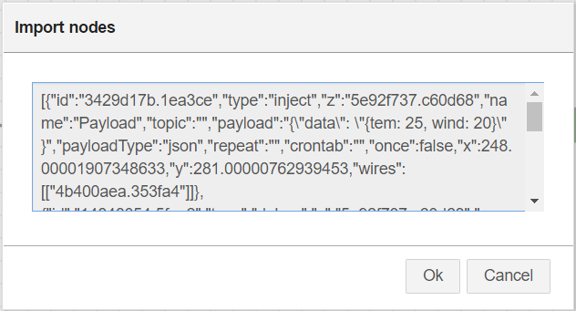
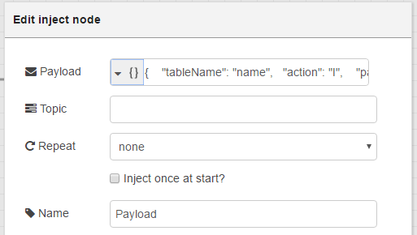

# node-red-contrib-azure-table-storage

node-red-contrib-azure-table-storage is a <a href="http://nodered.org" target="_new">Node-RED</a> node that allows you to work with Azure Table Storage. You can do all CRUD into Table Storage.


It contains one Node-RED cloud node: **Azure Table Storage**


#### Azure Table Storage

Node-Red node to connect to Azure Table Storage

This node allows you to do CRUD into Azure Table Storage.  It has the following payload format:

### To save entity
```
{ 
  "tableName": "name",
  "action": "I", 
  "partitionKey": "part1", 
  "rowKey": "row1", 
  "data": 
        {
          "Column": "Value"
        }
}
```

- If you send data as JSON, the node will save each key as a column.
 
### To read entity
```
{ 
  "tableName": "name",
  "action": "R", 
  "partitionKey": "part1", 
  "rowKey": "row1"
}
```

### To delete entity
```
{ 
  "tableName": "name",
  "action": "D", 
  "partitionKey": "part1", 
  "rowKey": "row1"
}
```

### To update entity
```
{ 
  "tableName": "name",
  "action": "U", 
  "partitionKey": "part1", 
  "rowKey": "row1", 
  "data": 
        {
          "Column": "Value"
        }
}
```

### To query entity
```
{
  "tableName": "name", 
  "action": "Q", 
  "selectdata": "columnName", 
  "fromcolumn": "from", 
  "where": "where"
}

 
### To delete table
```
{ 
  "tableName": "name",
  "action": "DT"
}
```


## Installation

```
npm install -g node-red-contrib-azure-table-storage


## How to Use


### Node-RED Setup
Follow the instructions [here](http://nodered.org/docs/getting-started/installation) to get Node-RED setup locally.

### Working with Azure Table Storage node

1. Open Node-RED, usually: <http://127.0.0.1:1880>

2. Go to Hamburger Menu -> Import -> Clipboard

    

3. Paste the following code into the "Import nodes" dialog

    

    ```
    [{"id":"95f88979.995298","type":"debug","z":"5e92f737.c60d68","name":"Log","active":true,"console":"false","complete":"true","x":843,"y":325,"wires":[]},{"id":"89d5f94e.906ea8","type":"Table Storage","z":"5e92f737.c60d68","name":"Azure Table Storage","x":645,"y":325,"wires":[["95f88979.995298"]]},{"id":"3429d17b.1ea3ce","type":"inject","z":"5e92f737.c60d68","name":"Payload","topic":"","payload":"{    \"tableName\": \"name\",   \"action\": \"I\",    \"partitionKey\": \"part2\",    \"rowKey\": \"row1\",    \"data\":          {           \"Column\": \"Value\"         } }","payloadType":"json","repeat":"","crontab":"","once":false,"x":424,"y":325,"wires":[["89d5f94e.906ea8"]]}]
    ```
4. Double-click the Payload node

    

5. Enter your desired payload, following the instructions, into the Payload field and click Done. Check "Inject once at start?" to insert data when you click Deploy.

    

6. Double-click the Azure Table Storage node, enter your Storage Account Name and Storage Account Key and click Done.

     
    
    

7. Click Deploy

    

8. Click the square button on the left side of the Register Payload node.
    
    

9. Click on the debug tab to your right and you'll see the device's primary and secondary keys.

    


### References
You can read more about Azure Storage [here](https://azure.microsoft.com/pt-br/documentation/services/storage/).


