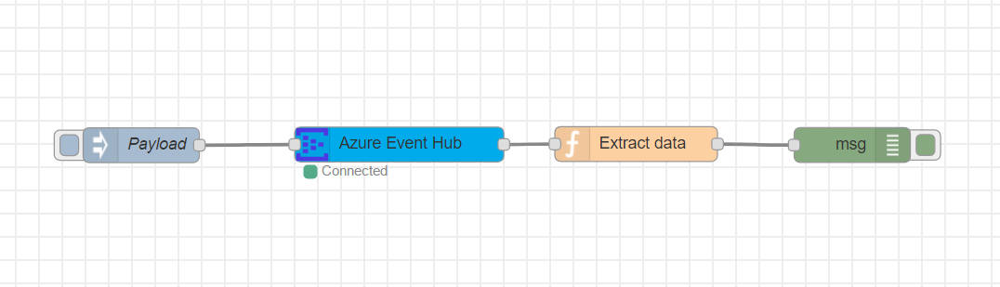
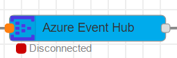
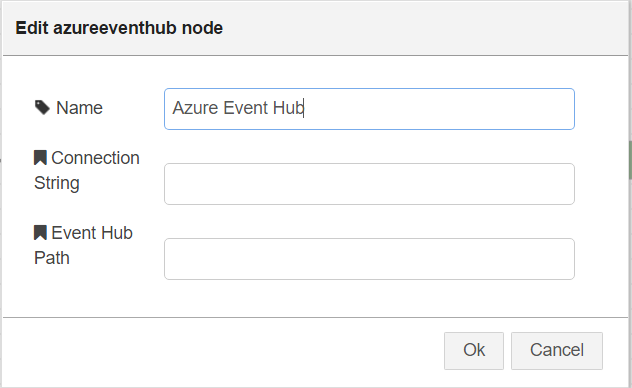

# node-red-contrib-azure-event-hub

node-red-contrib-azure-event-hub is a <a href="http://nodered.org" target="_new">Node-RED</a> node that allows you to send messages using Azure Event Hub.

It contains one Node-RED cloud node: **Azure Event Hub**



#### Azure Event Hub

This node allows you to send messages to your Azure Event Hub. It has the following payload format:
```
{
  "data": "{tem: 25, wind: 20}"
}
```

## Installation

```
npm install -g node-red-contrib-azure-event-hub-2
```


## How to Use


### Node-RED Setup
Follow the instructions [here](http://nodered.org/docs/getting-started/installation) to get Node-RED setup locally.

### Send Data to Azure Event Hub 

1. Open Node-RED, usually: <http://127.0.0.1:1880>

2. Go to Hamburger Menu -> Import -> Clipboard

    

3. Paste the following code into the "Import nodes" dialog

    

    ```
    [{"id":"3429d17b.1ea3ce","type":"inject","z":"5e92f737.c60d68","name":"Send Payload","topic":"","payload":"{\"data\": \"{tem: 25, wind: 20}\" }","payloadType":"json","repeat":"","crontab":"","once":false,"x":248.00001907348633,"y":281.00000762939453,"wires":[["4b400aea.353fa4"]]},{"id":"14848054.5fee2","type":"debug","z":"5e92f737.c60d68","name":"","active":true,"console":"false","complete":"true","x":860.0000734329224,"y":280.92996406555176,"wires":[]},{"id":"4b400aea.353fa4","type":"azureeventhub","z":"5e92f737.c60d68","name":"Azure Event Hub","x":456.10011291503906,"y":281.40005683898926,"wires":[["914c78a4.d99368"]]},{"id":"914c78a4.d99368","type":"function","z":"5e92f737.c60d68","name":"Extract data","func":"msg2 = {};\nvar b = new Buffer(msg,'base64');\nmsg2.payload = b.toString();\nreturn msg2;","outputs":1,"noerr":0,"x":674.0000190734863,"y":280.0000104904175,"wires":[["14848054.5fee2"]]}]
    ```

4. Double-click on the Send Payload node and modify the JSON in the Payload field to contain your data.

    

    

2. Double-click the Azure Event Hub node and enter your Connection String, Path, Name and click Done.

    

    

3. Click Deploy

    

4. Click the square button on the left side of the Send Payload node.
    
    

5. You should then see a Message received for the Event Hub in the debug pane.

    

### References
You can read more about Azure Event Hub [here](https://docs.microsoft.com/en-us/azure/event-hubs/).


