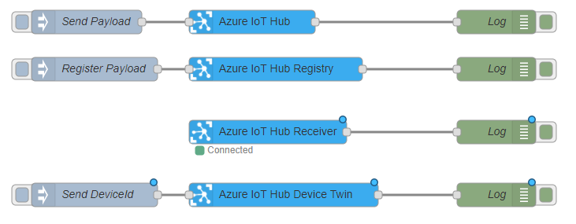
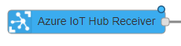
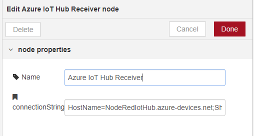
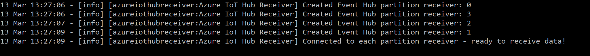
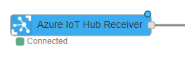
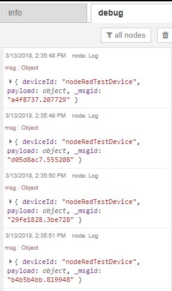
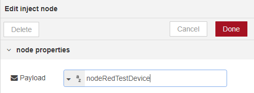
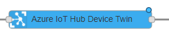
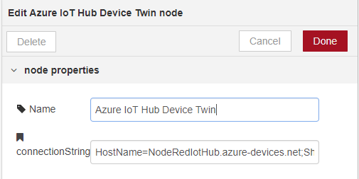

# node-red-contrib-azure-iot-hub

node-red-contrib-azure-iot-hub is a <a href="http://nodered.org" target="_new">Node-RED</a> node that allows you to send messages and register devices with Azure IoT Hub. This is a fork from the original Node-RED example by the Azure IoT team found [here](https://github.com/Azure/azure-iot-sdks/tree/master/node/device/node-red).

It contains a total of four Node-RED cloud nodes: **Azure IoT Hub**, **Azure IoT Registry**, **Azure IoT Hub Receiver** and **Azure IoT Hub Device Twin**



#### Azure IoT Hub

This node allows you to send messages to your Azure IoT Hub.  It has the following payload format:
```
{
  "deviceId": "testenode1",
  "key": "cw3nniq77BbjpOCDLqb7xEFTU509HeR6Ki1NwR20jj0=",
  "protocol": "amqp",
  "data": "{tem: 25, wind: 20}"
}
```
- deviceId is your device's unique id.
- key is your device's primary or secondary key.
- protocol options are: amqp, amqpws, mqtt or http.
- data can either be a plain string or string wrapped JSON.

#### Azure IoT Registry

This node allows you to registers devices with your Azure IoT Hub. It has the following payload format:

```
{
  "deviceId": "testenode1"
}
```

#### Azure IoT Hub Receiver

This is a simple node for receiving device-to-cloud messages via default Azure Events Hub endpoint. It does not require a payload.


#### Azure IoT Hub Device Twin

This is a simple node to retrieve Azure IoT Hub Device Twin(s). It has the following optional payload format:

```
"deviceId123"
```
- The optional payload can be the device Id in string format
- If this property type is not defined or is not a string, all Device Twins are retrieved
- Each input will produce an output with either ```msg.error``` as error object or ```msg.payload``` as an array of Device Twin data.


## Installation

```
npm install -g node-red-contrib-azure-iot-hub
```


## How to Use


### Node-RED Setup
Follow the instructions [here](http://nodered.org/docs/getting-started/installation) to get Node-RED setup locally.

### Register Azure IoT Hub Device

1. Open Node-RED, usually: <http://127.0.0.1:1880>

2. Go to Hamburger Menu -> Import -> Clipboard

    

3. Paste the following code into the "Import nodes" dialog

    

    ```
    [{"id":"6a913d9a.fa0844","type":"azureiothubregistry","z":"e621cbfa.f8a5f8","name":"Azure IoT Hub Registry","x":630,"y":240,"wires":[["14a58301.e60a9d"]]},{"id":"2fd0a3f.969ce5c","type":"inject","z":"e621cbfa.f8a5f8","name":"Register Payload","topic":"","payload":"{\"deviceId\":\"device146\"}","payloadType":"json","repeat":"","crontab":"","once":false,"x":400,"y":240,"wires":[["6a913d9a.fa0844"]]},{"id":"14a58301.e60a9d","type":"debug","z":"e621cbfa.f8a5f8","name":"Log","active":true,"console":"false","complete":"true","x":910,"y":240,"wires":[]},{"id":"f775e252.a49f2","type":"debug","z":"e621cbfa.f8a5f8","name":"Log","active":true,"console":"false","complete":"true","x":910,"y":180,"wires":[]},{"id":"95789379.e44d2","type":"azureiothub","z":"e621cbfa.f8a5f8","name":"Azure IoT Hub","protocol":"http","x":600,"y":180,"wires":[["f775e252.a49f2"]]},{"id":"228b0f18.7799c","type":"inject","z":"e621cbfa.f8a5f8","name":"Send Payload","topic":"","payload":"{\"deviceId\":\"device146\",\"key\":\"FgySFuUzwtQMrlS29GRr7luoW07RNAmKcMy5oPDA8pA=\",\"protocol\":\"http\",\"data\":\"{tem: 25, wind: 20}\"}","payloadType":"json","repeat":"","crontab":"","once":false,"x":390,"y":180,"wires":[["95789379.e44d2"]]},{"id":"817f33a3.ddf5f","type":"azureiothubreceiver","z":"e621cbfa.f8a5f8","name":"Azure IoT Hub Receiver","x":620,"y":340,"wires":[["c2825fc8.d6323"]]},{"id":"723d625e.52eb7c","type":"azureiothubdevicetwin","z":"e621cbfa.f8a5f8","name":"Azure IoT Hub Device Twin","x":640,"y":440,"wires":[["5e9fec30.6a52f4"]]},{"id":"c2825fc8.d6323","type":"debug","z":"e621cbfa.f8a5f8","name":"Log","active":true,"console":"false","complete":"true","x":910,"y":340,"wires":[]},{"id":"5e9fec30.6a52f4","type":"debug","z":"e621cbfa.f8a5f8","name":"Log","active":true,"console":"false","complete":"true","x":910,"y":440,"wires":[]},{"id":"3afc72bf.5c112e","type":"inject","z":"e621cbfa.f8a5f8","name":"Send DeviceId","topic":"","payload":"device146","payloadType":"str","repeat":"","crontab":"","once":false,"x":400,"y":440,"wires":[["723d625e.52eb7c"]]}]
    ```
4. Double-click the Register Payload node

    

5. Enter your desired deviceId into the Payload field and click Done. Check "Inject once at start?" to register this device when you click Deploy.

    

6. Double-click the Azure IoT Hub Registry node, enter your IoT Hub connection string and click Done.

     
    
    

7. Click Deploy

    

8. Click the square button on the left side of the Register Payload node.
    
    

9. Click on the debug tab to your right and you'll see the device's primary and secondary keys.

    


### Send Data to Azure IoT Hub

1. Double-click on the Send Payload node and modify the JSON in the Payload field to contain your deviceId, key, protocol and data.

    

    

2. Double-click the Azure IoT Hub node and enter your hostname and click Done.

    

    

3. Click Deploy

    

4. Click the square button on the left side of the Send Payload node.
    
    

5. You should then see a Message sent debug message in the debug pane.

    


### Reading all messages received into Azure IoT Hub

1. Double-click on the Azure IoT Hub Receiver node and enter the connectionString for your Azure IoT Hub and click Done.

    

    

2. Click Deploy

    

4. You should see the below messages on your command line from where you are running NodeRED. The Azure IoT Hub Receiver node should now say 'Connected'.
    
    

    

5. Once you have messages coming into your Azure IoT Hub, you should see them in the debug pane. The Azure IoT Hub Receiver node should now say 'Recieved'.

    

    

### Retrieving the Device Twin information

1. Double-click on the Send DeviceId node and modify the string in the Payload field to contain your deviceId and click Done. The input payload for Device Twin is optional and you can always delete this node to get Device Twin information for ALL your IoT devices.

    

    

2. Double-click on the Azure IoT Hub Device Twin node and enter the connectionString for your Azure IoT Hub and click Done.

    

    

3. Click Deploy

    

4. Click the square button on the left side of the Send Payload node.
    
    

5. You should then see a Device Twin information in the debug pane.

    

### References
You can read more about Azure IoT Hub [here](https://azure.microsoft.com/en-us/documentation/services/iot-hub/).


